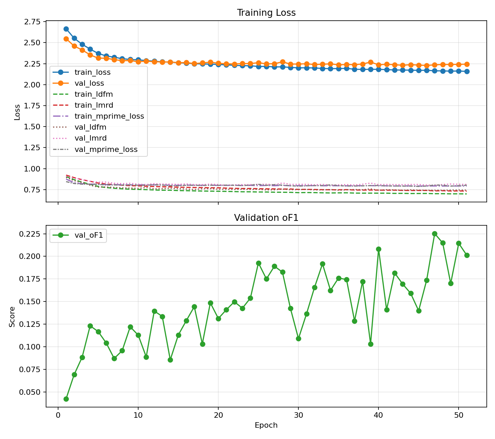

# README.md

# Deep PatchMatch for Scientific Image Forgery Detection

## Project Overview

This project implements an adaptation of Deep PatchMatch based on  
“Image Copy-Move Forgery Detection via Deep PatchMatch and Pairwise Ranking Learning” by Li et al. (available at https://arxiv.org/pdf/2404.17310)

The method is adapted for the Kaggle competition  
**Recod.ai/LUC - Scientific Image Forgery Detection**, which differs from the original paper in both task formulation and dataset characteristics.

For the full technical report: See [`docs/technical_report.md`](docs/technical_report.md)

The `docs/` directory also includes some plots and images showing the performance of the model.

## Deep PatchMatch description and modification

This project adapts Deep PatchMatch from a **three-class CMFD task** (background, source, target) to a **binary segmentation task** (authentic vs forged pixels).

Key modifications include:

- Use of pretrained frozen CNNs (VGG16 / ResNet18) instead of end-to-end training
- Integration of DINOv2 features in a parallel SEUNet branch
- Modified Zernike polynomial formulation
- Added offset re-randomization in PatchMatch to avoid local optima
- Incorporation of Zernike offsets in the DLF stage
- Use of post-processing techniques to improve prediction quality

---

## Running

The project uses the same environment as the base project. The main entrypoint is `main.py` which runs the baseline with specified settings.

--

## Implementation

The method is implemented across modular components:

- Feature extraction (`feature_extractors/`)
- PatchMatch (`cross_scale_patchmatch/`)
- Prediction + DLF (`prediction/`)
- Full pipeline (`pipeline.py`)

The implementation follows the structure of the original architecture, but is not fully end-to-end differentiable due to computational and practical constraints.

---

## Model Evaluation

The model is evaluated on the competition dataset using the OF1 metric, which strongly penalizes false positives and fragmented predictions. This is the logged training data from the final training run:

After training had concluded, the weights of the best-performing model were saved. Then, after analyzing predictions on the validation data, I had the idea to try different minimum component sizes, as the size $64$ was used above. As it was too expensive to run a full retrain, I instead used the best weights to rerun experiments on the same validation set. Based on this pass, I selected the final size $920$ to use on the hold-out test set, achieving a validation OF1 of $0.472$. This size aggressively prunes small components, but achieves a better average of1 score by removing false positives. The results are in the `docs/val_eval_component_sizes` directory.

Using the selected minimum component size of $920$, the model was run on the hold-out test set, achieving an of1 score of $0.466$. More details about this run can be viewed in `docs/heldout_test_eval/summary.json`.

Note that other metrics are also computed in order to gauge model performance, but "val_of1" is the important one for the Kaggle score.

More detailed analysis of the performance and a discussion of the competition metric can be found in the `docs/technical_report.md`.

## Notes

- Some implementation details were not specified in the original paper and required independent design choices
- LLMs were used for optimization and implementation support in selected components

See the technical report for full details.
