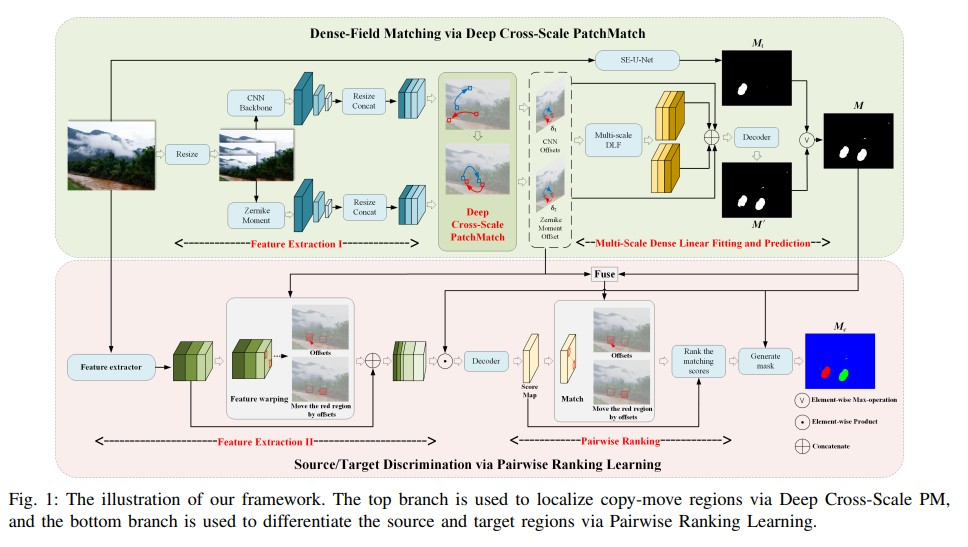
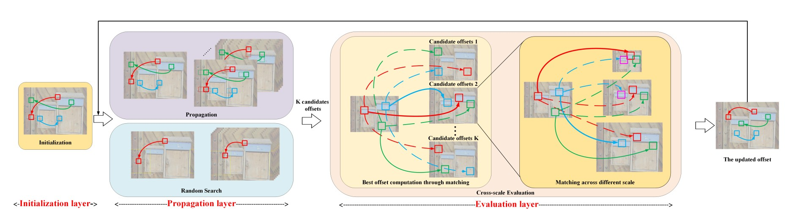
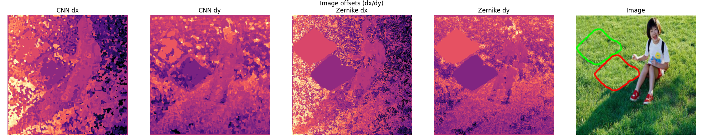

# README.md

_This readme contains documentation and information for the implementation._

## Introduction and motivation

This implementation of Deep PatchMatch is based on the paper "Image Copy-Move Forgery Detection via Deep PatchMatch and Pairwise Ranking Learning" (Li et. al., available at https://arxiv.org/pdf/2404.17310).

The implementation is tailored towards performance in the kaggle competition "Recod.ai/LUC - Scientific Image Forgery Detection" (https://www.kaggle.com/competitions/recodai-luc-scientific-image-forgery-detection/data). Because of this, there are a number of changes between my implementation and the paper version. These changes are in the interest of making the implementation perform and include the usage of DINOv2 and ResNet18 models, in addition tp pixel mask post-processing techniques.

Most significantly, the Kaggle competition involves single-channel CMFD. This is a prediction task where the model aims to generate a binary pixel map of the same size of the image, where a 0-value indicates an authentic pixel, whereas a 1-value indicates a forged pixel. A forged pixel is defined as one that is either part of the source region, where the object is copied from, or the target region, where the object is copied to.

The architecture proposed in the paper supports three-channel CMFD, where instead of a binary pixel map, the model should predict for each pixel whether it is part of the background, source, or target. I did not implement the components of the architecture related to performing three-channel CMFD.

In addition, many parameters related to the training process are neither mentioned by Li et. al. nor documented in code. This means that I had to do some experimentation on my own, leading to a structure that may have significant differences from the version Li et. al. used to achieve their results.

## Architecture and code structure

The architecture of the project is made to be as consistent as possible with the upper half of the architecture presented in the paper.

One important overrall difference is that although my version also can be configured to be end-to-end differentiable, I found it was more practical not to do so, insteading using a pretrained CNN for feature extraction.

Following is a more detailed description of the code and structure.

### Feature extractors

Inside `/feature_extractors` are the components utilized in the **Feature Extraction 1** part of the network. These feature a CNN feature extractor and a Zernike feature extractor. My implementation applies both these feature extractors to each image in the scalings $0.75, 1,$ and $1.5$, as is consistent with the paper.

#### CNN

In this implementation, the most practical choice is to use a frozen pretrained extractor such as the ones that are options in `cnn_feature_extractor.py` (VGG16 and RESNET18).
I also experimented with using Meta's _dinov2_vitb14_ model, but found that it was too memory-intensive to be safely utilized in this branch, particularly as my implementation batches and performs concurrent operations on the different image scaling. Note however that the DINOv2 was utilized in the independent SEUNet branch.

Although the paper does not explicitly state whether the CNN feature extractor is pretrained, it is reasonable to assume that it was not, given that the architecture is described as fully end-to-end differentiable. However, in practice, using an untrained feature extractor led to poor performance and proved difficult to optimize, largely because it required gradient propagation through the entire PatchMatch module. While the network is theoretically fully differentiable, propagating gradients through the full PatchMatch pipeline was too demanding for available GPU memory when combined with other operations. To address this, a frozen pretrained CNN based on VGG16 was used as the feature extractor. This modification not only improved stability and performance but also enabled the use of a hard argmax operation instead of the differentiable soft argmax controlled by the $\beta$ parameter described in the paper.

#### Zernike

In addition to the CNN feature extractor, the architecture features a parallell zernike feature extraction process based on zernike polynomials.

My implementation may not be fully consistent with the one supplied in the architecture at this point. The reason is that I through my own research found different formulas than the ones presented in the paper, and found compelling arguments to use these instead.

In the paper, the following formula is presented for the orthogonal radial polynomial $R_{p,q}(\rho)$:
$R_{p, q}(\rho) = \sum_{s=0}^{(1 - |p|)/2} \frac{(-1)^s[(1-s)!]\rho^{1-2s}}{s!(\frac{1+|p|}{2}-s)!(\frac{1-|p|}{2}+s)!}$

However, the source that the paper references for the zernike polynomials utilises this formula:
$R_{p, q}(\rho) = \sum_{s=0}^{(p - |q|)/2} \frac{(-1)^s[(p-s)!]\rho^{p-2s}}{s!(\frac{p+|q|}{2}-s)!(\frac{p-|q|}{2}+s)!}$
(rewritten to use the variables $p, q$ instead of $n, m$)

(see: https://www.researchgate.net/profile/Simon-Liao/publication/6534347_Accurate_Computation_of_Zernike_Moments_in_Polar_Coordinates/links/0c960524df7a3c3257000000/Accurate-Computation-of-Zernike-Moments-in-Polar-Coordinates.pdf)

These forms of the polynomials are also presented here by Wolfram Alpha: https://mathworld.wolfram.com/ZernikePolynomial.html
Another reason this formula seemed more logical is that it actually depends on $q$.

It is not explained in the paper why they utilise a different formula for the zernike polynomials. Perhaps it a simplification that worked well in practice, or perhaps it is an implementation error. Without further information, I found it more reasonable to use the formula presented by the other sources.

This implementation uses the same variable settings of setting the maximum order of ZM to 5, and obtain a 12-dimensional feature map for each image scaling.

As the zernike kernels are the same for each run, these are pre-computed and cached across runs.

### Deep Cross-Scale PatchMatch

When I implemented the Deep Cross-Scale PatchMatch algorithm as described in the paper, I had some issues with pixel offsets settling by finding local optima within a close vicinity. Essentially, as the features extracted within a local area are quite similar, it was hard for the algorithm to explore beyond this area. To rectify this, I implemented a method that re-randomized any offsets which were within a close vicinity to the pixel itself. As there is no mention of this in the paper, I am unsure whether my implementation diverges at this point or not.

The paper does not specify how many iterations PatchMatch is run for, but to achieve good offsets I found it necessary to use 24 iterations.
Here is an example of generated offsets visualized:

### Multi-Scale Dense Linear Fitting and Prediction

Although this too was hard to interpret, the interpretation I decided on was that the author's implementation only used the CNN offsets to calculate DLF error maps. However, as I was getting poor results using only these offsets, I chose to use Zernike offsets in error calculation as well.

### Loss functions

In addition to the two dice loss functions used in the paper for $M$ and $M_t$ ($M$ = final merged mask, $M_t$ = SEUnet predicted mask), I added BCELoss as we were using this in the main group implementation. I also added a dice loss term for $M'$ and an additional loss penalty for predicting false positives in an attempt to reduce false positives.

## Challenges

Although the network performed decently with regards to many metrics, it was very challenging to figure out a consistent way to have the network achieve a good OF1 score, which is the competition metric (https://www.kaggle.com/code/metric/recodai-f1/). This score is particularly punishing for two main reasons:

1. If even a few pixels are predicted to be forged on an authentic image, a score of 0 is immediately given.
2. It highly values consistent "blob"-like predictions, and predicting the correct amount of blobs. For instance, take the example of an image where there is one true copied object (source and target). Even if our model perfectly predicts this object (both source and target) if it generates say 5 other small blobs (even if they are only a few pixels each), the resulting of1 score has a maximum value of 1 \* (1/5) = 0.2.

In many of the runs, this was a major issue, with the model predicting way too many small regions on both authentic and forged images, even though it often also detected the true forged regions. In other words: recall was high, but it had poor precision.

A method that slightly helped this was applying post-processing operations of filtering out collections of pixels below a certain size. However, this is not a sure-fire fix, as there are also examples of copied regions in the dataset which are quite small. (example: train/forged/10.png).

Although it is hard to diagnose exactly what leads to this behaviour, through multiple runs and by comparing the two different branch, I believe this comes down in large part to a mistmatch between the architecture and the given dataset. The PatchMatch architecture relies mainly on finding groups of pixels which have high feature similarity. In the paper, it trains on a training set generated from MS COCO applying a copy-move with rotation and scaling operation to a random area of the image. The module is tested on a similarly generated synthetic dataset as well as the CASIA CMFD, CoMoFoD and CMH datasets.

All of these datasets feature "realistic" images. By this I mean that they are photos of nature or real life. Although the kaggle competition dataset does contain some images of this class, it also includes numerous examples which are graphics or figures featuring a background of only one consistent colour. It also includes images where the background is all very dark.

I believe that this difference in the backgrounds of images is highly significant in explaining the architectures performance on this dataset.

To align my experiments more with the paper and to test out some of these differences in image qualities, I also tested included the CASIA CMFD dataset in my training set. This choice was also inspired by the conception that CMFD is a general task where it is always helpful to have more data. However, for the final assessment of the project, the model is run with only the Kaggle competition data.

## Improvements given more time

Because of time limits and the complexity of the task I was not able to carry out all potential improvement points that could have led to a better model.

- Background modification in the scientific images - for instance, using a model/technique for automatically detecting background, and then adding noise to it in order to make the background less consistent.
  - The idea of this would be to cause less false positives from the PatchMatch module. When all of the background has a very similar colour and characteristics, the risk is high that we create false positives.
- Using a larger amount of data or more varied data.
- Simply running for more epochs.
- Further optimising the PatchMatch module, which was a major bottleneck in training the network. This would allow for more efficient running for a larger amount of epochs. (This part of the network is already optimised quite a lot and with some LLM assistance to make the runtime even feasible, but perhaps there is some other, better way to implement it.)
- Applying different post-processing techniques, as model performance is highly sensitive to this.

## Disclaimer: Use of LLM and other sources

This project is completed with some assistance from LLMs, and some of the code is inspired by the implementation used in the shared group project. Most notably, `dino_feature_extractor.py` and `pixelmaputil_mask.py` are heavily inspired by the group project versions.

### LLM usage

- Optimizations from more intuitive, vectorized pixel-by-pixel logic to using `torch.roll` in `PixelPropagator` and `.repeat` in `ZernikeFeatureExtractor`. This efficiency increase was necessary in order to make running the PatchMatch module feasible.
- Some helpers methods for ensuring correct dimensionality of tensors and error handling (e.g, `_as_batched_errors()` in `DLFDecoder`).
- Extensive usage in `MultiScaleDLF` in order to implement efficient fitting in most methods. Essentially, I implemented the `compute_errors_default()` method, but as it was unstable and slow, I used an LLM to improve on most of the helpers used here and to implement the `box_sum()` method.
- Inspiration and improvement for some of the splitting methods used in `dataset.py`.
- For creating some of the helper functions for saving and logging model behaviour during the pipeline run in `pipeline.py`
